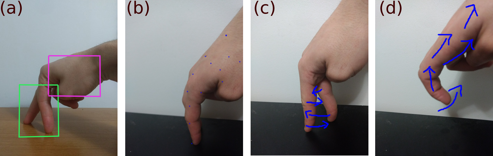

# Finger People
Finger People uses a hand-character model as a natural input for video games. In this model, the player's hand represents their character in the video game, where the index and middle finger serve as the character's legs, and the rest of the hand acts as a large upper-body. Finger People is implemented with a single RGB camera. 

See Finger People in action with Super Mario Bros. in [this video](https://www.youtube.com/watch?v=HhO2iqlgZCQ)!

## The Model

In **(a)**, we see the hand-character model, where the character's legs are boxed in green, and the character's body is boxed in magenta. Cells **(b)**, **(c)**, and **(d)** show some actions including idling, walking, and jumping, respectively. Finger People currently supports these actions, including walking, and movement directions. This model is most suitable for 2D side-scrolling platformers such as Super Mario Bros. and Sonic the Hedgehog.

## Input
Finger People currently supports a flexible range of input sources (cameras). The user can choose from a built-in camera, an Android device's camera (over LAN), or a video (for testing purposes). Finger People is best used with an Android device's camera because of its flexible placement.

## Implementation
For more information about Finger People, please refer to [the paper](paper.pdf), or look right at the code. Happy gaming!
